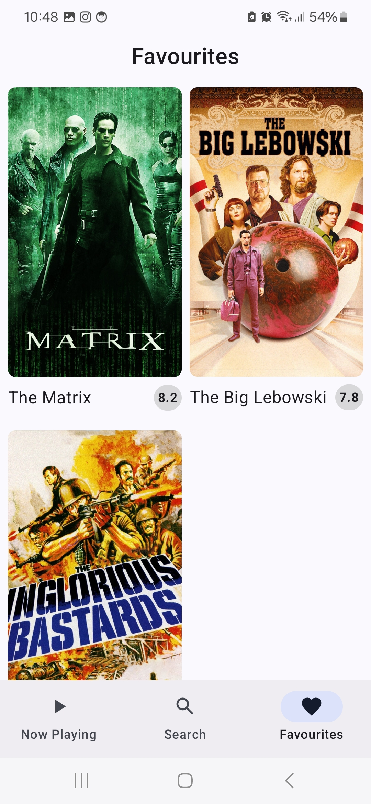

# MovieDB Application

🎬 MovieDB – Discover, Search & Like Your Favorite Movies! 🎥

Stay up to date with the latest movies currently playing in theaters with Movie DB! 
Whether you're searching for a specific film, exploring trending movies, or saving your favorites, this app makes it easy to find and track what you love.

Key Features:\
⭐ Now Playing Movies – Browse the latest films currently in theaters.\
🔍 Search Any Movie – Find movies instantly with a powerful search bar.\
📖 Detailed Movie Info – Get movie details, synopsis, ratings and year of production.\
❤️ Like & Save – Mark your favorite movies for quick access later.\

## Installation
Clone this repository and import into **Android Studio**
```bash
git clone git@github.com:michalsimbiga/MovieDB.git
```

## Configuration Guide for Movie DB App

To use the **Movie DB** app, you need to set up an API access token from **[The Movie Database (TMDb)](https://www.themoviedb.org/)**. Follow these steps to configure your app:

### 1. Generate an API Access Token
1. Go to [TMDb's website](https://www.themoviedb.org/).
2. Sign in or create an account.
3. Navigate to **Settings > API**.
4. Generate a **Read Access Token**.

### 2. Add the API Token to Your Project
1. Open your project's root directory.
2. Locate the `local.properties` file (create it if it doesn’t exist).
3. Add the following line, replacing `YOUR_ACCESS_TOKEN` with your actual token:

   ```properties
   API_ACCESS_TOKEN=YOUR_ACCESS_TOKEN
   ```

### 3. Access the Token in Your Code
Since the application uses gradle secrets plugin, api access token is available in BuildConfig class

## Screenshots
### 1. Light Theme

<p float="left">




</p>

### 2. Dark Theme

<p float="left">


</p>


## Tech Stack
Kotlin, Jetpack Compose, DataStore, Hilt, Compose Navigation, Kotlinx Serialization, Coil, MVI


